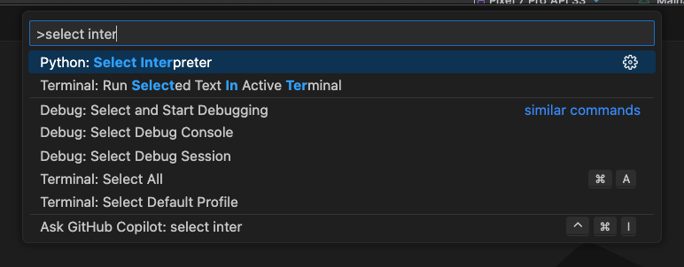
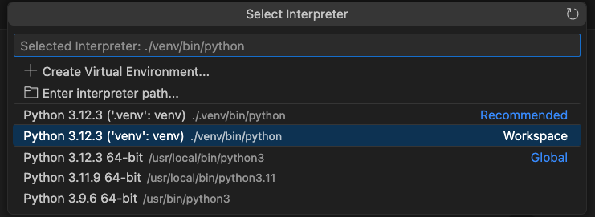

## Interpreter Installation Guide

### Step 1:

Run the command `pip3 install virtualenv`

### Step 2:

Run the command `python -m virtualenv venv`

### Step 3:

#### Visual Studio code:

3.1: Install the Python extension.

>Name: Python
>Id: ms-python.python
>Description: Python language support with extension access points for IntelliSense (Pylance), Debugging (Python Debugger), linting, formatting, refactoring, unit tests, and more.
>Version: 2024.6.0
>Publisher: Microsoft
>>VS Marketplace Link: https://marketplace.visualstudio.com/items?itemName=ms-python.python

3.2 Press F1 in VSCode and select the option `Select interpreter`

3.3 Select the python file at the address `env/bin/python`

### Step 4: Run the project

Run the command `python app.py`

## Connection with PostgreSQL

- Have PostgreSQL installed

- Install libpq-dev with the command `apt install libpq-dev`

- Install psycopg2 `pip install psycopg2`

